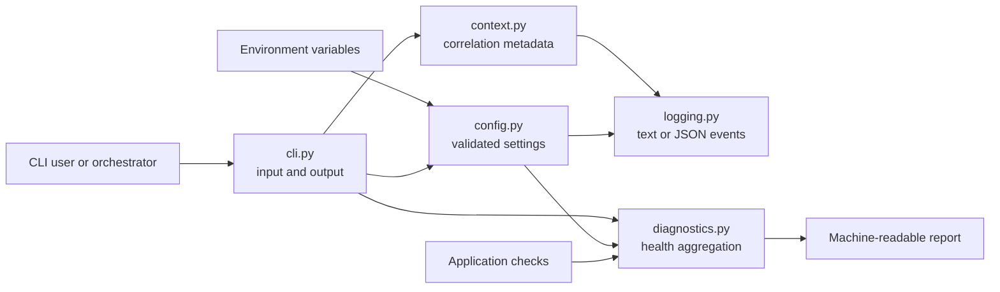

<div align="center">

# Python Starter Kit

**A production-friendly, framework-neutral foundation for modern Python applications.**

Start with validated configuration, structured logging, health diagnostics, strict quality
checks, reproducible packaging, secure automation, and complete project governance already in
place—then replace the sample behavior with your product.

[](https://github.com/DzCodeProgrammer/Starter-kit-Python/actions/workflows/ci.yml)


[](LICENSE)

[Quick start](#quick-start) · [Features](#what-is-included) ·
[Architecture](#architecture) · [Development](#development-workflow) ·
[Documentation](docs/index.md) · [Contributing](CONTRIBUTING.md)

</div>

---

## Why this starter kit exists

Starting a Python repository is easy. Establishing all the less-visible contracts that make it
safe to maintain, ship, and operate is not. This project provides those contracts without forcing
an application framework or adding third-party runtime dependencies.

It is designed around five principles:

1. **Small runtime surface** — the example application uses only the Python standard library.
2. **Strict by default** — typing, linting, warnings, branch coverage, metadata, and documentation
   are verified rather than treated as optional cleanup.
3. **Reproducible delivery** — dependencies are locked, distributions are built and smoke-tested,
   and the container installs a non-editable production environment.
4. **Observable operation** — configuration, contextual logs, build metadata, and composable health
   checks have explicit, machine-readable contracts.
5. **Secure automation** — minimal GitHub token permissions, immutable action pins, dependency
   auditing, SBOM generation, and workflow analysis are part of the normal path.

Use it for a CLI, worker, service, automation tool, or typed library. The sample remains
intentionally compact so product-specific architecture can grow without fighting scaffolding.

## Table of contents

- [What is included](#what-is-included)
- [Architecture](#architecture)
- [Quick start](#quick-start)
- [Command-line interface](#command-line-interface)
- [Configuration](#configuration)
- [Runtime building blocks](#runtime-building-blocks)
- [Project structure](#project-structure)
- [Development workflow](#development-workflow)
- [Testing and quality](#testing-and-quality)
- [Packaging and distribution](#packaging-and-distribution)
- [Container](#container)
- [Documentation](#documentation)
- [CI and release automation](#ci-and-release-automation)
- [Adapting the template](#adapting-the-template)
- [Security and maintenance](#security-and-maintenance)
- [Open-source foundations](#open-source-foundations)
- [Contributing and support](#contributing-and-support)

## What is included

| Area | Included foundation |
| --- | --- |
| Runtime | Python 3.11–3.14, `src` layout, typed package marker, zero third-party runtime dependencies |
| CLI | Installable `starter-kit` command, module execution, subcommands, version output, meaningful exit codes |
| Configuration | Frozen typed settings, environment-variable parsing, normalization, validation, safe serialization |
| Observability | Human-readable or single-line JSON logs, context-local correlation fields, sanitized diagnostics |
| Health | Pluggable timed checks, aggregate `ok`/`degraded`/`unhealthy` state, build and runtime metadata |
| Tests | pytest, property-based tests with Hypothesis, strict warnings, branch coverage, isolated install smoke tests |
| Code quality | Ruff linting and formatting, strict mypy, complexity rules, dead-code and dependency-declaration checks |
| Supply chain | Locked dependencies, vulnerability audit, CycloneDX SBOM, verified wheel and source distribution |
| Documentation | MkDocs Material, strict builds, API generation with mkdocstrings, architecture and operations guides |
| Container | Multi-stage image, pinned uv binary, production-only environment, bytecode compilation, non-root user |
| Automation | Cross-platform CI, scheduled checks, concurrency control, verified GitHub release artifacts |
| Repository | Dev container, Dependabot, CODEOWNERS, issue forms, PR template, changelog, security and conduct policies |

## Architecture

The runtime is deliberately organized into replaceable modules with a narrow responsibility:



- `config.py` owns process-level settings and fails early on invalid values.
- `context.py` keeps correlation fields isolated across threads and asynchronous tasks.
- `logging.py` configures process-wide output without hiding the standard `logging` API.
- `diagnostics.py` executes health checks, measures latency, and sanitizes unexpected failures.
- `cli.py` translates command-line input into calls to those reusable components.

The `src` layout ensures tests and local scripts import the installed package rather than an
accidental repository-root copy. See the detailed [architecture guide](docs/architecture.md) and
[ADR 0001](docs/adr/0001-zero-runtime-dependencies.md).

## Quick start

### Prerequisites

- [Git](https://git-scm.com/)
- [uv](https://docs.astral.sh/uv/) 0.8 or newer
- Python does not need to be installed separately when uv is allowed to manage it
- Docker is optional and only required for container workflows

Clone and initialize the complete development environment:

```bash
git clone https://github.com/DzCodeProgrammer/Starter-kit-Python.git
cd Starter-kit-Python
uv sync --all-groups
```

Exercise the installed application:

```bash
uv run starter-kit --version
uv run starter-kit hello --name Developer
uv run starter-kit show-config
uv run starter-kit health --pretty
```

The same CLI is available through Python's module runner:

```bash
uv run python -m starter_kit hello --name Developer
```

Run the full local verification suite before making changes:

```bash
uv run python scripts/check.py
uv build
```

## Command-line interface

| Command | Purpose |
| --- | --- |
| `starter-kit --version` | Print the installed application version |
| `starter-kit hello [--name NAME]` | Run the minimal sample command and emit an application log |
| `starter-kit show-config` | Print the active non-secret settings as sorted JSON |
| `starter-kit health [--pretty]` | Print runtime, build, platform, and health-check metadata as JSON |

Discover commands and arguments directly from the executable:

```bash
uv run starter-kit --help
uv run starter-kit health --help
```

The `hello` command demonstrates the default text log and normal output. Its timestamp depends on
the current time:

```text
2026-08-18T10:00:00+0700 INFO starter_kit.cli: Greeting requested
Hello, Developer!
```

The health endpoint is deliberately machine-readable. Timing, platform, Python patch version, and
timestamp values vary by environment:

```json
{
  "app_name": "starter-kit-python",
  "build_commit": "unknown",
  "checks": [
    {
      "detail": "Python runtime is responsive",
      "duration_ms": 0.003,
      "name": "runtime",
      "status": "pass"
    }
  ],
  "environment": "development",
  "platform": "linux-x86_64",
  "python_version": "3.13.7",
  "status": "ok",
  "timestamp": "2026-08-18T03:00:00Z",
  "version": "0.1.0"
}
```

Invalid configuration is reported on standard error and exits with code `2`, making deployment
failures explicit and script-friendly.

## Configuration

Settings are read once from environment variables with the `STARTER_KIT_` prefix. Values are
trimmed and normalized before validation.

| Variable | Default | Accepted values / contract |
| --- | --- | --- |
| `STARTER_KIT_APP_NAME` | `starter-kit-python` | Any non-empty string |
| `STARTER_KIT_ENVIRONMENT` | `development` | `development`, `test`, `staging`, `production` |
| `STARTER_KIT_DEBUG` | `false` | `true/false`, `1/0`, `yes/no`, `on/off` |
| `STARTER_KIT_LOG_LEVEL` | `INFO` | `DEBUG`, `INFO`, `WARNING`, `ERROR`, `CRITICAL` |
| `STARTER_KIT_LOG_FORMAT` | `text` | `text` or `json` |
| `STARTER_KIT_BUILD_COMMIT` | `unknown` | A non-empty release, build, or Git identifier |

Copy `.env.example` as a local reference:

```bash
cp .env.example .env
```

The application intentionally does **not** auto-load `.env`. Production platforms should inject
configuration through their native environment or secret mechanism. Local developers can use a
dotenv loader, shell profile, IDE run configuration, or uv's environment options without coupling
the runtime package to one vendor.

For PowerShell, a one-command JSON logging example is:

```powershell
$env:STARTER_KIT_LOG_FORMAT = "json"
uv run starter-kit hello --name Developer
```

For POSIX-compatible shells:

```bash
STARTER_KIT_LOG_FORMAT=json uv run starter-kit hello --name Developer
```

## Runtime building blocks

### Typed settings

`Settings` is an immutable, slotted dataclass. Tests or embedding applications can supply an
explicit mapping instead of mutating global process state:

```python
from starter_kit.config import Settings

settings = Settings.from_env(
    {
        "STARTER_KIT_ENVIRONMENT": "test",
        "STARTER_KIT_LOG_FORMAT": "json",
        "STARTER_KIT_DEBUG": "true",
    }
)

assert settings.environment == "test"
assert settings.debug is True
```

### Contextual structured logging

Use the standard library logger and bind correlation metadata for the lifetime of an operation:

```python
import logging

from starter_kit.context import log_context
from starter_kit.logging import configure_logging

configure_logging(level="INFO", log_format="json")
logger = logging.getLogger(__name__)

with log_context(request_id="req-7f2", component="worker"):
    logger.info("Job started")
```

The event is serialized as one JSON object, suitable for log aggregation:

```json
{"timestamp":"2026-08-18T03:00:00.000Z","level":"INFO","logger":"__main__","message":"Job started","context":{"request_id":"req-7f2","component":"worker"}}
```

Context is backed by `contextvars`, so concurrent threads and async tasks do not leak correlation
fields into one another. Nested contexts restore their prior values even when an exception occurs.

### Composable health checks

Add application-specific checks without changing the collector:

```python
from starter_kit.config import Settings
from starter_kit.diagnostics import CheckOutcome, collect_health


def database_check() -> CheckOutcome:
    return CheckOutcome(name="database", status="pass", detail="Connection is responsive")


report = collect_health(Settings(), checks=[database_check])
print(report.as_dict()["status"])
```

Check outcomes map to an overall state:

| Check results | Overall state |
| --- | --- |
| All checks `pass` | `ok` |
| One or more checks `warn`, with no failures | `degraded` |
| One or more checks `fail` | `unhealthy` |

Every check is timed. Unexpected exceptions become a sanitized failure containing the exception
type—but not its potentially sensitive message. Transport layers can map this contract to HTTP,
Kubernetes probes, job supervision, or monitoring systems.

## Project structure

```text
.
├── .devcontainer/
│   └── devcontainer.json        # Reproducible editor/container development setup
├── .github/
│   ├── ISSUE_TEMPLATE/           # Structured bug and feature forms
│   ├── workflows/ci.yml          # Quality, security, tests, package, docs, container
│   ├── workflows/release.yml     # Verified tag-to-GitHub-release pipeline
│   ├── CODEOWNERS                # Review ownership
│   ├── dependabot.yml            # Python and Actions dependency updates
│   └── pull_request_template.md  # Review checklist
├── docs/
│   ├── adr/                      # Architecture decisions
│   ├── architecture.md           # Package boundaries and extension points
│   ├── development.md            # Contributor workflow
│   ├── operations.md             # Logging, health, and deployment guidance
│   ├── reference.md              # Generated Python API reference
│   ├── references.md             # Open-source research and inspiration
│   └── releasing.md              # Release and optional PyPI guidance
├── scripts/
│   └── check.py                  # Cross-platform local quality gate
├── src/starter_kit/
│   ├── __init__.py               # Public version
│   ├── __main__.py               # `python -m starter_kit`
│   ├── cli.py                    # Command-line orchestration
│   ├── config.py                 # Typed environment configuration
│   ├── context.py                # Context-local correlation metadata
│   ├── diagnostics.py            # Health contracts and aggregation
│   ├── logging.py                # Text and JSON logging setup
│   └── py.typed                  # PEP 561 typing marker
├── tests/                        # Unit, integration-style CLI, and property tests
├── .env.example                  # Documented configuration surface
├── .pre-commit-config.yaml       # Commit and push hooks
├── Dockerfile                    # Multi-stage non-root production image
├── mkdocs.yml                    # Strict documentation configuration
├── pyproject.toml                # Packaging, dependencies, and tool policy
└── uv.lock                       # Reproducible dependency resolution
```

Repository-level policies are kept beside the code: [CHANGELOG](CHANGELOG.md),
[code of conduct](CODE_OF_CONDUCT.md), [contributing guide](CONTRIBUTING.md),
[security policy](SECURITY.md), and [support guide](SUPPORT.md).

## Development workflow

Synchronize the exact locked environment, including all optional development groups:

```bash
uv sync --all-groups
```

Install the lightweight commit hooks and the complete pre-push gate:

```bash
uv run pre-commit install
uv run pre-commit install --hook-type pre-push
```

Typical inner-loop commands:

```bash
uv run ruff format .
uv run ruff check --fix .
uv run mypy src tests scripts
uv run pytest
uv run mkdocs serve
```

Add dependencies through uv so `pyproject.toml` and `uv.lock` remain synchronized:

```bash
uv add <runtime-package>
uv add --group dev <development-package>
```

Do not hand-edit `uv.lock`. Review dependency changes like source changes and commit the lockfile
with the manifest update.

## Testing and quality

The single cross-platform entry point below mirrors the main local quality policy:

```bash
uv run python scripts/check.py
```

| Check | Tool | Purpose |
| --- | --- | --- |
| Lint and complexity | Ruff | Catch correctness, security, modernization, async, logging, and style issues |
| Formatting | Ruff formatter | Keep code layout deterministic |
| Static typing | mypy strict mode | Enforce typed public and internal contracts |
| Behavior and properties | pytest + Hypothesis | Verify examples, edge cases, and invariants |
| Branch coverage | coverage.py | Fail below the configured 95% project threshold |
| Project metadata | validate-pyproject | Validate standardized packaging metadata |
| Spelling | codespell | Check source, documentation, and repository policies |
| Dependency declarations | deptry | Find missing, transitive, and unused dependency declarations |
| Dead code | Vulture | Flag high-confidence unreachable or unused code |
| Documentation | MkDocs strict mode | Reject broken navigation, references, and documentation warnings |
| Vulnerabilities | pip-audit | Audit the resolved local dependency environment |
| Workflow security | Zizmor pedantic mode | Analyze GitHub Actions for supply-chain risks |

Tests run with warnings treated as errors, strict pytest configuration, strict marker handling, and
strict expected-failure behavior. The suite also includes property-based checks and subprocess CLI
tests. CI separately installs both the wheel and source archive into clean isolated environments
and executes `tests/smoke_test.py`.

## Packaging and distribution

The package follows PEP 621 metadata, builds with Hatchling, ships typing information, and produces
both a wheel and source distribution:

```bash
uv build
uv run twine check dist/*
uv run check-wheel-contents dist/*.whl
```

Reproduce CI's isolated installation tests:

```bash
uv run --isolated --no-project --with dist/*.whl tests/smoke_test.py
uv run --isolated --no-project --with dist/*.tar.gz tests/smoke_test.py
```

Runtime dependencies belong in `[project.dependencies]`. Contributor tooling is separated into the
PEP 735 `dev`, `docs`, and `quality` dependency groups so production installation remains small.

## Container

Build and run the production image:

```bash
docker build --tag starter-kit-python:local .
docker run --rm starter-kit-python:local health --pretty
```

Run another CLI command and inject deployment metadata:

```bash
docker run --rm \
  --env STARTER_KIT_BUILD_COMMIT=abc1234 \
  starter-kit-python:local hello --name Container
```

The image is designed for a production baseline:

- a multi-stage build keeps uv and build-time state out of the runtime image;
- the uv binary source is pinned and dependencies install from the lockfile;
- development dependencies are excluded and the project is installed non-editably;
- Python bytecode is compiled during the build;
- the application runs as the unprivileged `app` user;
- stdout and stderr remain unbuffered for container logging;
- production and JSON logging are the container defaults;
- the default command emits health metadata and is smoke-tested by CI.

Supply secrets and configuration at runtime through the target platform. Never bake credentials
into the image. See the [operations guide](docs/operations.md) for deployment conventions.

## Documentation

Documentation uses MkDocs Material with search, light and dark themes, code-copy controls, and
generated API pages from type-annotated docstrings.

Start the live development server:

```bash
uv run mkdocs serve
```

Build exactly as CI does:

```bash
uv run mkdocs build --strict
```

The documentation set covers local development, system design, architectural decisions,
operations, releases, API contracts, and the upstream sources that informed this starter.

## CI and release automation

Every pull request is evaluated by independent, least-privilege jobs:

| Job | Verification |
| --- | --- |
| Quality checks | Ruff, mypy, metadata, spelling, dependencies, dead code, workflow security |
| Dependency audit | Vulnerability scan and downloadable CycloneDX development SBOM |
| Test matrix | Python 3.11–3.14 on Linux plus Python 3.13 on Windows and macOS |
| Build package | Wheel and source archive, metadata/content checks, isolated installation smoke tests |
| Build documentation | Warning-free strict MkDocs build |
| Build container | Production image build and execution of the health command |

The workflow also has manual and weekly scheduled entry points. Concurrency rules cancel obsolete
CI runs, jobs have explicit timeouts, default token permissions are read-only, checkout credentials
are not persisted, and third-party actions are pinned to immutable commits.

Pushing a SemVer tag such as `v0.2.0` triggers a separate release workflow:

1. Build wheel and source distribution from the tagged source.
2. Validate metadata and wheel contents.
3. Smoke-test both artifact formats in isolated environments.
4. Transfer verified artifacts to a narrowly privileged job.
5. Create a GitHub release with generated notes and attached distributions.

PyPI publication is intentionally opt-in because a template cannot know the final distribution
owner or name. The [release guide](docs/releasing.md) explains how to add token-free trusted
publishing after those decisions are made.

## Adapting the template

Treat the first product commit as a deliberate ownership pass:

- [ ] Rename `src/starter_kit/` and update imports in `src/`, `tests/`, and `scripts/`.
- [ ] Change the distribution name, description, keywords, author, URLs, and CLI script in
      `pyproject.toml`.
- [ ] Replace `starter-kit-python`, `starter-kit`, and `STARTER_KIT_` throughout code and docs.
- [ ] Update the version in both `pyproject.toml` and `src/starter_kit/__init__.py`.
- [ ] Replace the sample `hello` command with real product entry points.
- [ ] Add domain code behind adapters rather than placing all behavior in `cli.py`.
- [ ] Define product-specific settings and classify which values may appear in diagnostics.
- [ ] Add dependency checks for databases, queues, storage, or external services where useful.
- [ ] Update Docker labels, base image policy, runtime command, and orchestration probes.
- [ ] Replace repository URLs, CODEOWNERS, support channels, and vulnerability contact paths.
- [ ] Choose the license and review organizational compliance requirements.
- [ ] Configure branch protection and require the applicable CI checks.
- [ ] Decide whether GitHub Pages, package registries, deployment, and PyPI publishing are needed.
- [ ] Replace this section with product-specific setup, architecture, and operational runbooks.

Useful search commands before declaring the rename complete:

```bash
git grep -n "starter_kit"
git grep -n "starter-kit"
git grep -n "STARTER_KIT"
git grep -n "DzCodeProgrammer"
```

After customization, regenerate the lockfile, run the complete quality gate, build both package
artifacts, and test the container before opening the first product pull request.

## Security and maintenance

- Report suspected vulnerabilities privately through the process in [SECURITY.md](SECURITY.md).
- Never place real secrets, credentials, production data, or full exception details in diagnostics.
- Dependabot maintains Python and GitHub Actions dependency proposals.
- `pip-audit` checks the installed dependency graph and generates a CycloneDX SBOM in CI.
- Zizmor analyzes workflow configuration in pedantic mode.
- Release publishing separates unprivileged artifact construction from privileged release creation.
- Security fixes target the latest `main` revision while the project remains pre-1.0.

Automated checks reduce risk but do not replace threat modeling, review, secret scanning, or the
security requirements of the eventual product and deployment environment.

## Open-source foundations

This starter synthesizes maintained practices rather than copying one generated project. Its main
references include:

- [PyPA Sample Project](https://github.com/pypa/sampleproject) for standards-based packaging and
  source layout.
- [Scientific Python Cookie](https://github.com/scientific-python/cookie) for strict tests,
  dependency groups, documentation, and repository policy.
- [Hypermodern Python](https://github.com/cjolowicz/cookiecutter-hypermodern-python) for an
  integrated approach to typing, tests, coverage, packaging, and security.
- [Astral uv](https://github.com/astral-sh/uv) for dependency management, CI, isolated testing, and
  container practices.
- [Copier UV](https://github.com/pawamoy/copier-uv) and
  [Serious Scaffold Python](https://github.com/serious-scaffold/ss-python) for project lifecycle,
  cross-platform automation, and maintenance conventions.
- [Zizmor](https://github.com/zizmorcore/zizmor) and official GitHub/PyPA guidance for workflow and
  release supply-chain security.

The complete rationale and direct upstream guide links are recorded in
[docs/references.md](docs/references.md). Revisit them periodically because Python packaging and
supply-chain guidance continue to evolve.

## Contributing and support

Contributions are welcome. Read [CONTRIBUTING.md](CONTRIBUTING.md), keep changes focused, add tests
for behavioral changes, and update documentation and the changelog when public behavior changes.

- Use [GitHub Issues](https://github.com/DzCodeProgrammer/Starter-kit-Python/issues) for reproducible
  bugs and actionable feature proposals.
- Use the channels in [SUPPORT.md](SUPPORT.md) for help and usage questions.
- Follow [CODE_OF_CONDUCT.md](CODE_OF_CONDUCT.md) in all project interactions.
- Use private vulnerability reporting for security-sensitive findings.

## License

Released under the [MIT License](LICENSE). You may use, modify, and distribute this starter subject
to the license terms.
